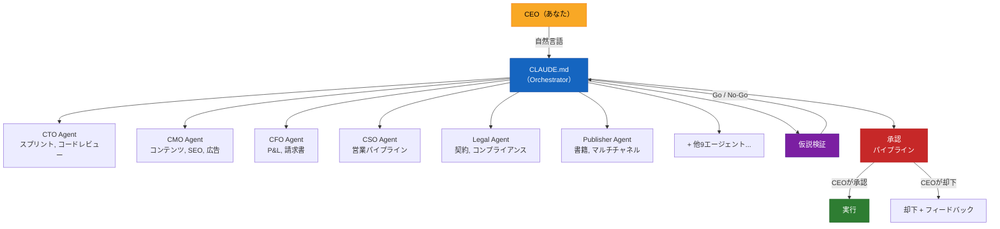

# AI-CEO Framework

[English](README.md) | **[日本語](README.ja.md)** | [中文](README.zh-CN.md)


## Claude Code で会社経営を丸ごと自動化

**15のAIエージェント + 5つの本番スキル + 承認パイプライン。ひとり会社を完全自動化。**

---

### 実際の会社で実証済み

これはおもちゃのプロジェクトではありません。AI-CEO Framework は1年以上にわたり、実際の会社運営で稼働し続けています。

| 指標 | 実績 |
|------|------|
| 自動化率 | 業務オペレーションの **98%** |
| 月額コスト | **約$250/月** (Claude Code Max + インフラ) |
| 管理部門数 | **11部門** (開発、マーケティング、営業、財務、法務、CS、HR、出版、グロース、コンサルティング、事業開発) |
| 本番稼働開始 | **2025年** (1年以上) |
| AIエージェント数 | **15** の専門エージェント |
| 再利用可能スキル | **5** つの本番検証済みスキル定義 |

CEO1人。従業員ゼロ。経営チームはすべてClaude Codeが担う。

---

## フレームワークの中身

### 15のAIエージェント (`agents/`)

各エージェントには、ペルソナ、専門分野、ワークフロー、出力テンプレート、品質チェックが定義されています。

| エージェント | 役職 | 主な機能 |
|------------|------|---------|
| **CTO** | 最高技術責任者 | スプリント計画、コードレビュー、アーキテクチャ判断、ホットフィックス管理 |
| **CMO** | 最高マーケティング責任者 | コンテンツ戦略、SEO、広告キャンペーン、SNS運用、分析 |
| **CFO** | 最高財務責任者 | 月次P&L、コスト最適化、請求書発行、キャッシュフロー予測 |
| **CSO** | 最高営業責任者 | パイプライン管理、提案書作成、リード戦略、CRM |
| **Legal** | 法務責任者 | 契約書レビュー、コンプライアンスチェック、OSSライセンス監査、利用規約/プライバシーポリシー |
| **CS Lead** | カスタマーサクセス | エスカレーション管理、FAQ整備、オンボーディング最適化、NPS |
| **HR** | 人事責任者 | エージェントスキル監査、トレーニング計画、パフォーマンスレビュー |
| **Publisher** | 出版部門長 | 書籍企画、執筆、品質スコアリング、マルチチャネル出版 |
| **Content Engine** | コンテンツプロデューサー | SEO記事、書籍、LP、広告コピー、SNS投稿 |
| **Growth** | グロースハッカー | ファネル最適化、A/Bテスト、マネタイズ、価格戦略 |
| **Consulting** | コンサルティングVP | AI自動化コンサルティング、診断、提案書 |
| **BizDev** | 事業開発 | リード獲得、パートナーシップ開発、アップセル戦略 |
| **Tax Accountant** | 税務アドバイザー | 仕訳入力、確定申告準備、節税対策、税務カレンダー |
| **Morning Digest** | デイリーブリーフィング | 全部門の状態を収集し、CEOへ朝のダイジェストを生成 |
| **Setup Wizard** | オンボーディング | インタビュー形式のセットアップ、初期設定ファイルを自動生成 |

### 11のスキル (`skills/`)

エージェントが特定のタスクを実行するために呼び出す、再利用可能なスキル定義。

| スキル | 用途 |
|--------|------|
| `validate-hypothesis` | 6フェーズのビジネス仮説検証（誰も欲しがらないものを作ることを防ぐ） |
| `write-blog` | プラットフォーム別スコアリング付きブログ記事作成（75点以上が基準） |
| `polish-content` | ブログ記事の編集・品質改善 |
| `upgrade-automation` | Claude Codeの新機能を検出し、自動化をアップグレード |
| `generate-cover` | HTML+CSS+Playwrightによる書籍カバー画像生成 |

### Orchestrator (`CLAUDE.md`)

システムの頭脳。単一のCLAUDE.mdが以下を担います:

- 自然言語のリクエストを理解し、適切な部門へルーティング
- 対外アクションの承認パイプラインを管理
- 部門横断タスクの調整
- 新施策に対する仮説検証ゲートの強制
- コンテキスト使用率を最小限に維持（10-15%）

### Steering Files (`steering/`)

| ファイル | 用途 |
|---------|------|
| `permissions.md` | 権限レベル（read-only / draft / execute）、コスト閾値、デプロイルール |
| `policies.md` | セキュリティ、品質管理、コスト管理、開発プロセス、コンプライアンスポリシー |

### セットアップスクリプト (`setup.sh`)

5分で完了。スクリプトを実行し、いくつかの質問に答えるだけで、AI-CEO Frameworkが稼働します。

---

## アーキテクチャ



## 仕組み

### 承認パイプライン

対外的なアクション（メール送信、SNS投稿、請求書発行、デプロイ）はすべて以下のフローを通ります:

1. **エージェントがドラフトを作成** し、`approval-queue.md` に登録
2. **CEOがレビュー** `/ai-ceo:approve <id>` または `/ai-ceo:reject <id> "理由"` で判断
3. **承認されたアイテムが自動実行** される

これにより、AIが不適切なメールを送ったり、壊れたコードを本番にデプロイすることを防ぎます。

### 仮説検証ゲート

新しいプロダクト、広告チャネル、大きな投資を行う前に:

1. **Phase 0**: アイデアの出所を確認（顧客起点か自分起点か？）
2. **Gate 1**: 市場の存在確認（データに基づく裏付け）
3. **Gate 2**: 顧客・競合インタビュー（3社以上）
4. **Gate 3**: インタビュー評価（ファクト強度スコアリング）
5. **Gate 4**: 支払い意思の確認（LOI、先行予約、書面でのコミットメント）
6. **Gate 5**: 最小限の実証テスト（ノーコードで検証）
7. **判定**: Go / No-Go / 撤退（学びの文書化付き）

リトライは最大2回。2回失敗したら撤退レポートが生成されます。誰も欲しがらないものを作ることを防ぐための仕組みです。

---

## クイックスタート（5分）

### 1. クローンとセットアップ

```bash
# フレームワークをあなたのプロジェクトにコピー
cp -r ai-ceo-framework-pack/.claude/ your-project/.claude/
cp ai-ceo-framework-pack/CLAUDE.md your-project/CLAUDE.md

# セットアップスクリプトを実行
cd your-project
bash .claude/setup.sh
```

### 2. セットアップの質問に回答

スクリプトから以下の質問がされます:
- 会社名
- あなたの名前（CEO）
- 事業内容
- 開発中のプロダクト
- 技術スタック
- 外部ツール（会計ソフト、CRMなど）
- 優先的に自動化したい部門
- AI関連の予算

### 3. 使い始める

プロジェクトディレクトリでClaude Codeを開き、自然な言葉で話しかけるだけです:

```
> 「今日の状況は？」
> 「AI自動化についてブログ記事を書いて」
> 「開発スプリントを回して」
> 「この契約書をレビューして: [貼り付け]」
> 「クライアントXへの請求書を作って」
> 「マーケティングのKPIを教えて」
```

コマンドを直接指定することもできます:

```
> /ai-ceo:morning          -- 朝のブリーフィング
> /ai-ceo:status           -- 状態確認
> /ai-ceo:dev:sprint       -- 開発スプリント実行
> /ai-ceo:mkt:content-plan -- 月間コンテンツカレンダー
> /ai-ceo:fin:monthly-report -- 月次P&L
> /ai-ceo:approve AQ-001   -- 承認待ちアイテムを承認
```

---

## ディレクトリ構成

セットアップ後、プロジェクトは以下の構成になります:

```
your-project/
  CLAUDE.md                          # Orchestrator（メインの頭脳）
  .claude/
    agents/
      cto-agent.md                   # 15のエージェント定義
      cmo-agent.md
      ...
    skills/
      validate-hypothesis.md         # 5つのスキル定義
      write-blog.md
      ...
  .company/
    VISION.md                        # ミッション・ビジョン
    STATE.md                         # 現在の経営状態
    ROADMAP.md                       # 四半期ロードマップ
    approval-queue.md                # 承認待ちキュー
    steering/
      permissions.md                 # 権限レベル・閾値
      policies.md                    # 会社ポリシー
      brand.md                       # ブランドガイドライン
      tech-stack.md                  # 技術スタック規約
    products/
      {product-name}/
        STATE.md                     # プロダクト別状態
    departments/
      dev/STATE.md                   # 部門別状態
      marketing/STATE.md
      sales/STATE.md
      finance/STATE.md
      cs/STATE.md
      legal/STATE.md
      hr/STATE.md
      publishing/STATE.md
      consulting/STATE.md
    decisions/
      {YYYY-MM}.md                   # CEO意思決定ログ
```

---

## よくある質問

**Q: Claude Codeの無料プランでも使えますか？**
A: フレームワーク自体はどのClaude Codeプランでも動作します。ただし、サブエージェント（Agent toolを使用）にはClaude Code Max（$100/月）、またはAnthropic APIキーを設定したClaude Codeが必要です。最適なパフォーマンスのためにはClaude Code Maxを推奨します。

**Q: 対応言語は？**
A: フレームワークのテンプレートは英語です。すべてのエージェント定義とコマンドは英語で動作します。セットアップ後に、お好きな言語で動作するようカスタマイズ可能です。

**Q: 独自のエージェントを追加できますか？**
A: はい。`.claude/agents/` に同じフォーマット（frontmatter + ペルソナ + ワークフロー + 品質チェック）で新しい `.md` ファイルを作成するだけです。Orchestratorが自動的に検出します。

**Q: 不要なエージェントを削除できますか？**
A: はい。エージェントファイルを削除するだけです。Orchestratorは存在しない部門があっても正常に動作します。

**Q: 長いCLAUDE.mdを書くだけとは何が違うのですか？**
A: 3つの重要な違いがあります: (1) Orchestratorはサブエージェントに委任することで、コンテキスト使用率を10-15%に抑えます。すべてをひとつのプロンプトに詰め込むことはしません。 (2) 承認パイプラインにより、AIが無許可で対外アクションを実行することを防ぎます。 (3) 各エージェントが専門的な知識、品質チェック、出力テンプレートを持っており、モノリシックなCLAUDE.mdでは維持できない精度を実現します。

**Q: データは安全ですか？**
A: すべてのデータはローカルの `.company/` ディレクトリに保存されます。Claude Codeの通常のAPI通信以外に、外部にデータが送信されることはありません。セキュリティポリシーと権限管理が標準で組み込まれています。

**Q: チーム（ソロではなく）でも使えますか？**
A: フレームワークはひとり会社向けに設計されていますが、少人数のチームでも問題なく使えます。承認パイプラインは単一の意思決定者（CEO）を前提としています。大規模なチームの場合は、承認フローのカスタマイズが必要かもしれません。

**Q: エージェントが失敗したらどうなりますか？**
A: エラーハンドリングが組み込まれています。フィードバック付きで最大3回リトライし、それでも失敗した場合は承認キュー経由でCEOにエスカレーションされます。エラーログは各部門の error-log.md に記録されます。

---

## Before / After

| | AI-CEOなし | AI-CEOあり |
|---|---|---|
| **セットアップ** | 巨大なCLAUDE.md 1つに全部詰め込み | 15の専門エージェント + 薄いOrchestrator |
| **コンテキスト使用** | 即座に100%消費 | Orchestratorは10-15%、残りは委任 |
| **対外アクション** | AIがメール送信・デプロイし放題 | 承認パイプライン: ドラフト -> レビュー -> 実行 |
| **エラー対応** | エラーは無視される | 自動リトライ3回、その後CEOへエスカレーション |
| **新施策** | まず作る、検証は後回し | 仮説検証ゲート（6フェーズ） |
| **品質** | 基準なし | エージェントごとの品質チェック + スコア閾値 |
| **スケーリング** | 全部書き直し | `.md`ファイルを追加するだけ、Orchestratorが自動検出 |

---

## このフレームワークの本質

これはプロンプト集ではありません。**AIで会社を運営するための、本番グレードのオペレーティングシステム**です。すべてのエージェント、すべてのワークフロー、すべての品質チェックは、1年以上の日常的な運用を通じて磨き上げられたものです。仮説検証スキルだけでも、筋の悪いアイデアを早期に潰すことで、数万ドル規模の損失を防いできました。

Claude Codeで会社全体を運営してきた経験の結晶 -- 失敗も、修正も、生き残ったフレームワークも、すべてです。

---

## Star History

[](https://star-history.com/#JOINCLASS/ai-ceo-framework)

---

## コントリビューション

コントリビューションを歓迎します! バグ報告、機能リクエスト、プルリクエスト -- どんな貢献も大歓迎です。

- **Issues**: バグやアイデアがあれば [Issueを作成](https://github.com/JOINCLASS/ai-ceo-framework/issues) してください。
- **Pull Requests**: リポジトリをフォークし、変更を加えてPRを送ってください。変更は焦点を絞り、明確な説明を付けてください。
- **Discussions**: Issueほどではない質問やアイデアは [Discussion](https://github.com/JOINCLASS/ai-ceo-framework/discussions) でどうぞ。

---

## ライセンス

MIT License。詳細は [LICENSE](LICENSE) をご覧ください。

---

Claude Codeで構築。本番環境で検証済み。あなたの会社でもすぐに使えます。
