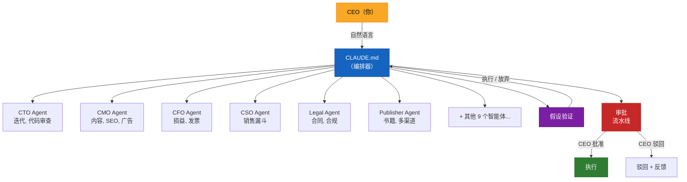

# AI-CEO Framework

[English](README.md) | [日本語](README.ja.md) | **[中文](README.zh-CN.md)**


## 用 Claude Code 运营你的整个公司

**15 个 AI 智能体 + 5 个生产级技能 + 审批流水线。一人公司，全面自动化。**

---

### 经过实战检验的生产系统

这不是一个玩具项目。AI-CEO Framework 已经在真实公司中运行了超过一年：

| 指标 | 数据 |
|------|------|
| 自动化率 | **98%** 的业务运营 |
| 每月成本 | **约 $250/月**（Claude Code Max + 基础设施） |
| 管理部门 | **11 个**（开发、市场、销售、财务、法务、客户成功、人力、出版、增长、咨询、商务拓展） |
| 投入生产 | **2025 年**起（1 年以上） |
| AI 智能体 | **15 个**专业智能体 |
| 可复用技能 | **5 个**经过生产验证的技能定义 |

一位 CEO。零名员工。由 Claude Code 驱动的完整高管团队。

---

## 包含内容

### 15 个 AI 智能体（`agents/`）

每个智能体都有明确的角色定位、专业能力、工作流程、输出模板和质量检查机制。

| 智能体 | 职位 | 核心能力 |
|--------|------|----------|
| **CTO** | 首席技术官 | 迭代计划、代码审查、架构决策、紧急修复管理 |
| **CMO** | 首席营销官 | 内容策略、SEO、广告投放、社交媒体、数据分析 |
| **CFO** | 首席财务官 | 月度损益表、成本优化、发票管理、现金流预测 |
| **CSO** | 首席销售官 | 销售漏斗管理、方案撰写、获客策略、CRM |
| **Legal** | 法务总监 | 合同审查、合规检查、OSS 许可证审计、服务条款/隐私政策 |
| **CS Lead** | 客户成功负责人 | 问题升级管理、FAQ、用户引导优化、NPS |
| **HR** | 首席人力官 | 智能体能力审计、培训计划、绩效评估 |
| **Publisher** | 出版总监 | 书籍策划、写作、质量评分、多渠道出版 |
| **Content Engine** | 内容制作人 | SEO 文章、书籍、落地页文案、广告文案、社交媒体帖子 |
| **Growth** | 增长黑客 | 漏斗优化、A/B 测试、变现策略、定价 |
| **Consulting** | 咨询副总裁 | AI 自动化咨询、诊断分析、方案提案 |
| **BizDev** | 商务拓展 | 线索挖掘、合作伙伴开发、增购策略 |
| **Tax Accountant** | 税务顾问 | 记账凭证、报税准备、节税策略、合规日历 |
| **Morning Digest** | 每日简报 | 汇总各部门状态，生成 CEO 早间摘要 |
| **Setup Wizard** | 初始化向导 | 以问答形式完成初始设置，自动生成全部配置文件 |

### 11 个技能（`skills/`）

可复用、可调用的技能定义，供智能体在执行特定任务时调用。

| 技能 | 用途 |
|------|------|
| `validate-hypothesis` | 6 阶段商业假设验证（避免做出没人需要的产品） |
| `write-blog` | 博客文章创作，附带平台适配评分（75 分及格线） |
| `polish-content` | 博客内容的编辑打磨与质量提升 |
| `upgrade-automation` | 检测 Claude Code 新功能并升级你的自动化体系 |
| `generate-cover` | 使用 HTML+CSS+Playwright 生成书籍封面 |

### 编排器（`CLAUDE.md`）

整个系统的大脑。一份 CLAUDE.md 文件即可：

- 理解自然语言请求，将其路由到对应部门
- 管理对外操作的审批流水线
- 协调跨部门任务
- 对新举措强制执行假设验证关卡
- 维持精简的上下文占用（10-15% 使用率）

### 管控文件（`steering/`）

| 文件 | 用途 |
|------|------|
| `permissions.md` | 权限级别（read-only / draft / execute）、成本阈值、部署规则 |
| `policies.md` | 安全、质量、成本管理、开发流程、合规等制度 |

### 安装脚本（`setup.sh`）

5 分钟完成安装。运行脚本，回答几个问题，你的 AI-CEO Framework 就上线了。

---

## 架构



## 运作原理

### 审批流水线

所有对外操作（邮件、社交媒体帖子、发票、部署）都会经过：

1. **智能体创建草稿**，写入 `approval-queue.md`
2. **CEO 审核**，执行 `/ai-ceo:approve <id>` 或 `/ai-ceo:reject <id> "reason"`
3. **通过审批的事项自动执行**

这能防止 AI 发出尴尬的邮件，或把有问题的代码部署到生产环境。

### 假设验证关卡

在启动任何新产品、新广告渠道或重大投资之前：

1. **Phase 0**：创意来源检查（来自客户需求还是自我想象？）
2. **Gate 1**：市场存在性确认（需要数据支撑）
3. **Gate 2**：客户/竞品访谈（至少 3 家）
4. **Gate 3**：访谈结果评估（事实强度评分）
5. **Gate 4**：支付意愿验证（意向书、预购、书面承诺）
6. **Gate 5**：最小可行测试（无代码验证）
7. **决策**：执行 / 放弃 / 撤退（附带经验总结）

最多重试 2 次。如果两次都失败，将生成撤退报告。这能防止你做出没人需要的产品。

---

## 快速上手（5 分钟）

### 1. 克隆并安装

```bash
# 将框架复制到你的项目中
cp -r ai-ceo-framework-pack/.claude/ your-project/.claude/
cp ai-ceo-framework-pack/CLAUDE.md your-project/CLAUDE.md

# 运行安装脚本
cd your-project
bash .claude/setup.sh
```

### 2. 回答设置问题

脚本会询问你：
- 公司名称
- 你的姓名（CEO）
- 业务描述
- 正在开发的产品
- 技术栈
- 使用的外部工具（记账软件、CRM 等）
- 优先自动化哪些部门
- AI 预算

### 3. 开始使用

在你的项目目录中打开 Claude Code，直接用自然语言交流即可：

```
> "今天公司情况怎么样？"
> "写一篇关于 AI 自动化的博客"
> "跑一个开发迭代"
> "审查一下这份合同：[粘贴内容]"
> "给客户 X 生成一张发票"
> "我们的营销 KPI 是多少？"
```

或者使用显式命令：

```
> /ai-ceo:morning          -- 每日早间简报
> /ai-ceo:status           -- 快速查看状态
> /ai-ceo:dev:sprint       -- 运行开发迭代
> /ai-ceo:mkt:content-plan -- 月度内容日历
> /ai-ceo:fin:monthly-report -- 月度损益报告
> /ai-ceo:approve AQ-001   -- 审批待处理事项
```

---

## 目录结构

安装完成后，你的项目将包含：

```
your-project/
  CLAUDE.md                          # 编排器（系统大脑）
  .claude/
    agents/
      cto-agent.md                   # 15 个智能体定义
      cmo-agent.md
      ...
    skills/
      validate-hypothesis.md         # 5 个技能定义
      write-blog.md
      ...
  .company/
    VISION.md                        # 使命与愿景
    STATE.md                         # 当前经营状态
    ROADMAP.md                       # 季度路线图
    approval-queue.md                # 待审批事项
    steering/
      permissions.md                 # 权限级别与阈值
      policies.md                    # 公司制度
      brand.md                       # 品牌规范
      tech-stack.md                  # 技术栈约定
    products/
      {product-name}/
        STATE.md                     # 单产品状态
    departments/
      dev/STATE.md                   # 各部门状态
      marketing/STATE.md
      sales/STATE.md
      finance/STATE.md
      cs/STATE.md
      legal/STATE.md
      hr/STATE.md
      publishing/STATE.md
      consulting/STATE.md
    decisions/
      {YYYY-MM}.md                   # CEO 决策日志
```

---

## 常见问题

**问：这个框架支持 Claude Code 免费版吗？**
答：框架本身兼容所有 Claude Code 方案。但子智能体（使用 Agent 工具）需要 Claude Code Max（$100/月）或带 Anthropic API 密钥的 Claude Code。为获得最佳体验，推荐使用 Claude Code Max。

**问：框架支持哪些语言？**
答：框架模板为英文。所有智能体定义和命令均以英文编写。安装完成后，你可以自定义智能体以支持任何语言。

**问：我可以添加自己的智能体吗？**
答：可以。在 `.claude/agents/` 中创建一个新的 `.md` 文件，遵循相同格式（frontmatter + 角色定位 + 工作流程 + 质量检查）。编排器会自动发现它。

**问：可以删除不需要的智能体吗？**
答：可以。直接删除智能体文件即可。编排器会优雅地处理缺失的部门。

**问：这和直接写一个很长的 CLAUDE.md 有什么区别？**
答：三个关键区别：（1）编排器通过委派子智能体将自身上下文保持在 10-15%，而不是把所有内容塞进一个提示词里。（2）审批流水线防止 AI 擅自执行对外操作。（3）每个智能体都有专业知识、质量检查和输出模板，这是单一 CLAUDE.md 无法维持的。

**问：我的数据安全吗？**
答：所有数据都保存在你本地的 `.company/` 目录中。除了 Claude Code 正常的 API 调用外，不会向任何地方发送数据。框架内置了安全策略和权限控制。

**问：可以用于团队（而非一人公司）吗？**
答：框架为一人公司设计，但也适用于小型团队。审批流水线天然支持单一决策者（CEO）模式。对于更大的团队，你可能需要自定义审批流程。

**问：智能体失败了怎么办？**
答：内置错误处理机制：最多重试 3 次并反馈错误信息，然后通过审批队列升级给 CEO。错误日志会写入各部门的 error-log.md。

---

## Before / After

| | 没有 AI-CEO | 使用 AI-CEO |
|---|---|---|
| **设置** | 一个巨大的 CLAUDE.md 塞下所有内容 | 15 个专业智能体 + 精简编排器 |
| **上下文使用** | 瞬间消耗 100% | 编排器仅占 10-15%，其余委派 |
| **对外操作** | AI 随意发邮件、部署 | 审批流水线：草稿 -> 审核 -> 执行 |
| **错误处理** | 错误被默默忽略 | 自动重试 3 次，然后上报 CEO |
| **新举措** | 先做再说，验证靠后 | 假设验证关卡（6 个阶段） |
| **质量** | 没有标准 | 每个智能体独立质量检查 + 评分阈值 |
| **扩展** | 全部重写 | 添加一个 `.md` 文件，编排器自动发现 |

---

## 这个框架的本质

这不是一个提示词合集。这是一套**用 AI 运营公司的生产级操作系统**。每一个智能体、每一条工作流程、每一项质量检查，都经过了 1 年以上的日常使用打磨。单是假设验证技能就已经通过早期否决坏主意，节省了数万美元。

这是用 Claude Code 运营整个公司的提炼经验 -- 踩过的坑、修过的 bug、以及那些经受住考验的框架。

---

## Star History

[](https://star-history.com/#JOINCLASS/ai-ceo-framework)

---

## 贡献

欢迎贡献！无论是 Bug 报告、功能建议还是 Pull Request，所有参与都很有价值。

- **Issues**：发现 Bug 或有想法？请 [提交 Issue](https://github.com/JOINCLASS/ai-ceo-framework/issues)。
- **Pull Requests**：Fork 仓库，进行修改，提交 PR。请保持修改聚焦，并附上清晰的说明。
- **Discussions**：问题或想法还不够成为 Issue？欢迎发起 [Discussion](https://github.com/JOINCLASS/ai-ceo-framework/discussions)。

---

## 许可证

MIT License。详情请参阅 [LICENSE](LICENSE)。

---

用 Claude Code 构建。在生产环境验证。为你的公司准备就绪。
